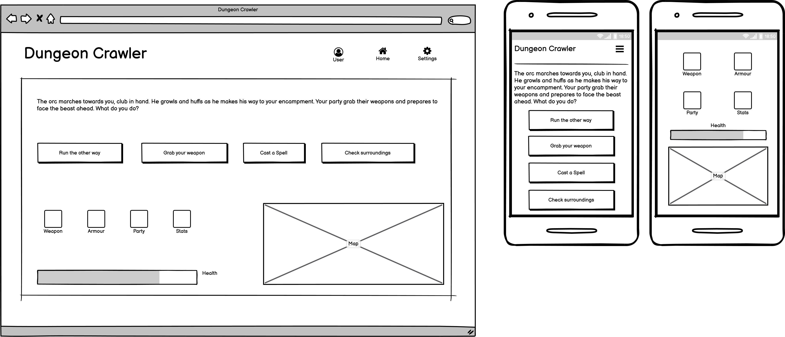
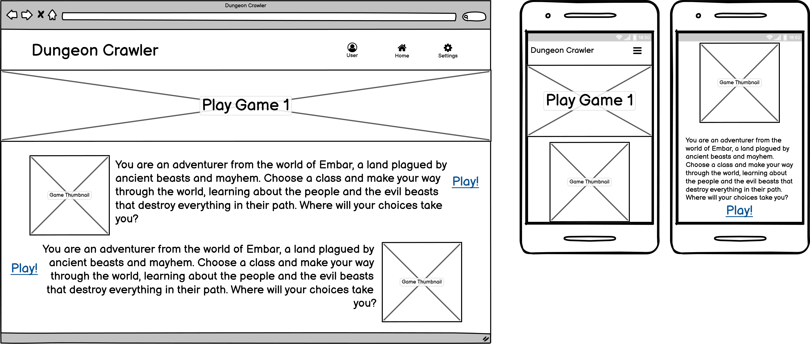
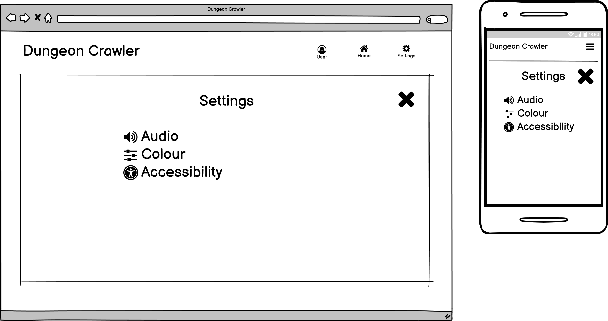
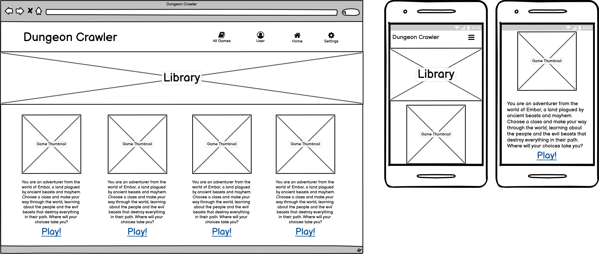
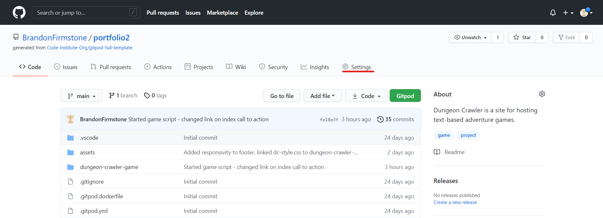
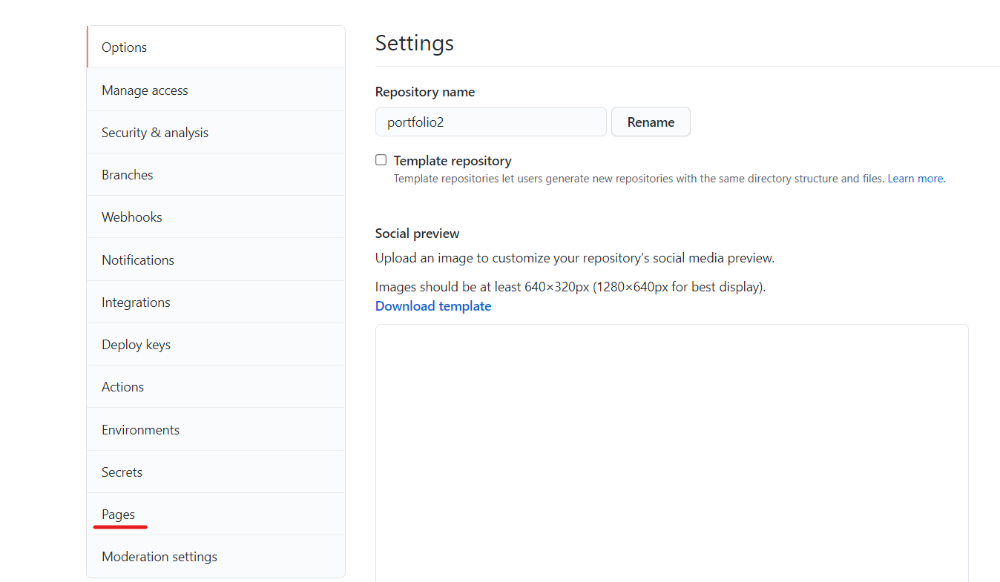
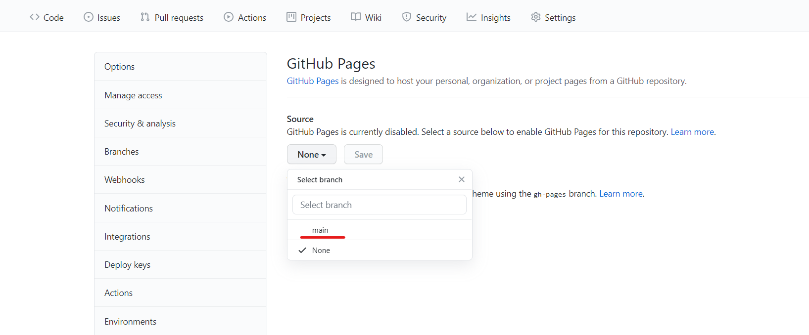
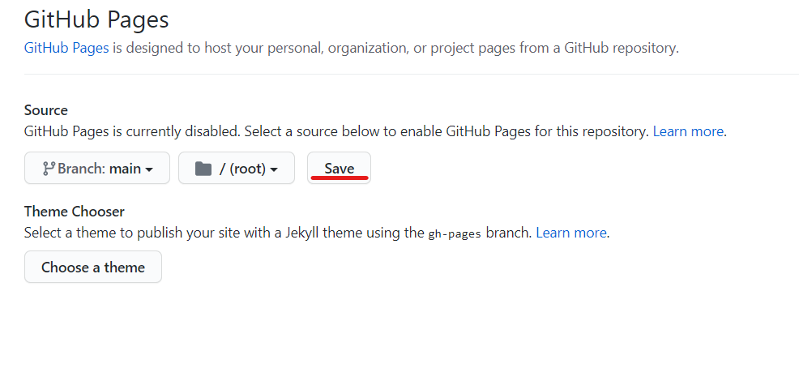
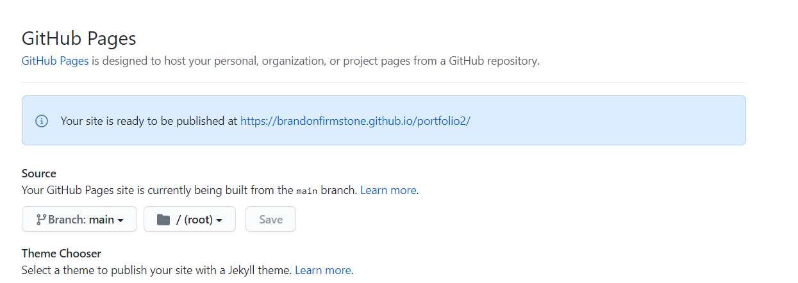
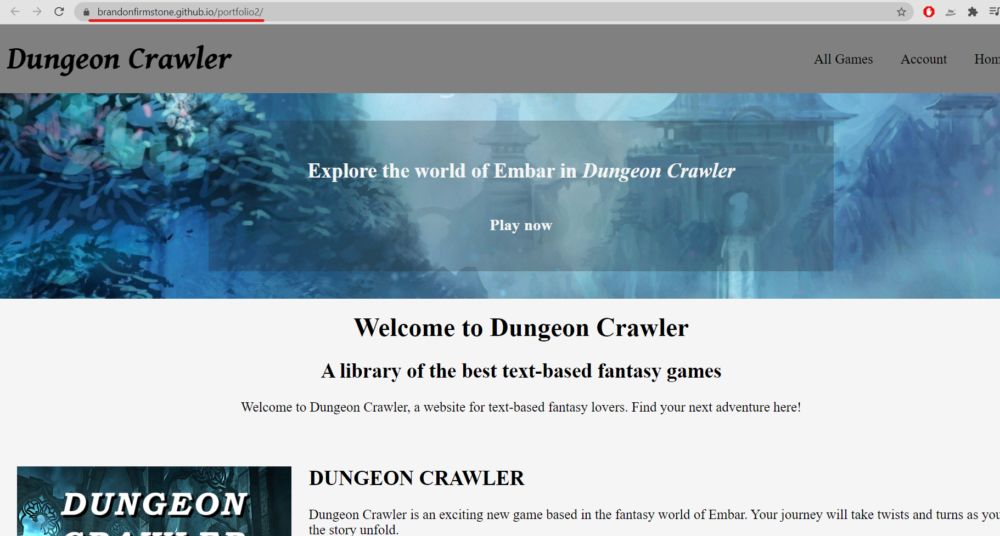

# Dungeon Crawler - A Library of Text-based Adventure Games

# Table of contents

- [Project Summary](#project-summary)
- [Project Design](#project-design)
  * [Project Goals](#project-goals)
  * [UX Design](#ux-design)
    + [Strategy](#strategy)
    + [Scope](#scope)
    + [Structure](#structure)
    + [Skeleton](#skeleton)
    + [Surface](#surface)
  * [Wire Frame Designs](#wire-frame-designs)
- [Development](#development)
  * [README Purpose](#readme-purpose)
  * [Site Structure](#site-structure)
  * [Naming Conventions](#naming-conventions)
  * [Languages Used](#languages-used)
  * [Tools Used](#tools-used)
- [Features](#features)
  * [Initial Features Desired](#initial-features-desired)
  * [Implemented Features](#implemented-features)
  * [Future/Desired Features](#future-desired-features)
- [Testing](#testing)
  * [Validation Testing](#validation-testing)
  * [Cross Browser and Cross Device Testing](#cross-browser-and-cross-device-testing)
  * [Manual Testing](#manual-testing)
  * [Known Fixed Bugs](#known-fixed-bugs)
    + [Aesthetic Bugs](#aesthetic-bugs)
    + [Functional Bugs](#functional-bugs)
  * [Known Unfixed Bugs](#known-unfixed-bugs)
    + [Aesthetic Bugs](#aesthetic-bugs-1)
    + [Functional Bugs](#functional-bugs-1)
- [Accessibility](#accessibility)
  * [Features](#features-1)
  * [Issues](#issues)
  * [Testing](#testing-1)
- [Deployment](#deployment)
- [Credits and Acknowledgements](#credits-and-acknowledgements)
  * [Content](#content)
  * [Media](#media)
  * [Acknowledgements](#acknowledgements)

# Project Summary
<strong>Dungeon Crawler</strong> is a website for hosting a collection of text-based adventure games using HTML, CSS and JavaScript. Each individual game may have different styles, mechanics, stories and genres. The idea of this project is to test the efficacy of creating a text-based game library with the goal of generating revenue. 
The long-term plan for Dungeon Crawler is to have recurring subscriptions to access the full library of games. Users can signup to play the free games, but must have a premium account to play the full library. 

# Project Design
The design of the website should be quite simplistic, to reflect the games hosted. That being said, it should be styled so that it fits in with the theme of 'Dungeon Crawler' and adventure games in general. That being said, below are the design consideration took into account when making this website.

## Project Goals
The project goals are as follows:
- Create a website structure that allows for adding multiple different JavaScript text-based games
- Add an adventure game to the site, that works completely and is an enjoyable experience
- Consider in business-terms the efficacy of increasing the scale of this concept website.

## UX Design
User experience design is of utmost importance in this project. Ensuring that the user can easily navigate the site, interact with the different games and has a positive experience makes it far more likely that the user will sign up for premium services. Below are UX Design considerations that have been taken into account.

### Strategy
#### Audience
The audience is old-school gamers and current adventure enthusiasts. Games such as Dungeons and Dragons are still vastly popular, so tapping into this market would be ideal. Enthusiasts and casual gamers are still interested in text-based games, as games such as AI Dungeon have massively swept social media and YouTube.

### Scope
The project deadline is 12/08/2021. In order to keep the scope down, the user system will not be implemented. Only one game will be developed for the library. The website will be a basic demonstration of what it will become. 

### Structure
The website will be structured to display a selection of the games available in the library. It will also link to the library in a call-to-action. The library will be in a tile format, with a thumbnail for each game, a short description underneath and a link to play the game. Each game can have different structures, but the game that will be made for demonstration purposes will be inside of a bordered div, with the text at the top, buttons underneath the text and different icons underneath representing different attributes to be linked to the player (for example, armour, weapons etc) and a health bar. Each game will have it's own directory, in order to keep them separated in a logical and tidy manner.

### Skeleton
#### Wire Frame Designs

### Surface

# Development

## README Purpose
The README is used in order to convey to the reader the purpose of this website and how it has been developed. Future developers that may work on this site as well as myself can refer to this document to find information regarding the website's current development stage, any bugs and issues found and more. It also means that future developers can keep to the same styles and keep the website consistent.

## Site Structure

## Naming Conventions
The naming conventions for each file within the repository is using lower-case characters and hyphens to separate the words. Classes and IDs in HTML will use this same format. Variables and other names in JavaScript will use camel case (Capitalizing the first letter of each word bar the first word. For example, camelCaseHere.) 

## Languages Used
The languages used for this website are as follows:
- HTML for the structure of the pages
- CSS for styling the pages
- JavaScript for interactivity and functionality (As well as the games on the site)

## Tools Used
For the development of this site, the following tools have been used:
- GitHub for version control and storing the in-development site
- GitPod for writing the code on the website
- Balsamiq Wireframes used to draw the wireframes that the website has been based on.
- GIMP for editing pictures and images
- GitHub Pages is used for the deployment of the site
- Twine for planning the story

# Features

## Initial Features Desired
### Website
- Showcase of the different games available
- Footer including business address and social links
- Summary pages for each game

### Dungeon Crawler Game
- Party system (Who the player is with)
- Inventory system (What the player has in their possession)
- Attribute system (Shows players skills, stats)
- Map system (Shows the player a map of the world and where they are currently)
- Class system that determines what options the player has based on their character

## Implemented Features

## Unimplemented Features
- The party, inventory and attribute systems have not been implemented due to time constraints. They are features that I would like to add to the game in the future.
- The map system has not been implemented due to time constraints. Producing the map of the world including the local areas that the player is can't fit into the time constraints

## Future/Desired Features
- User Logins
- Ecommerce, user subscriptions to unlock 'Premium' games

# Testing

## Validation Testing

## Cross Browser and Cross Device Testing

## Manual Testing

## Known Fixed Bugs

### Aesthetic Bugs

### Functional Bugs

## Known Unfixed Bugs

### Aesthetic Bugs

### Functional Bugs

# Accessibility

## Features

## Issues

## Testing

# Deployment
The deployment process is the process of allowing end users to access the software application. In this case, I am deploying the Dungeon Crawler website to Github Pages as a live website publicly accessible. 

## Step One

The first step is to navigate to the site's repository on GitHub. This is where all of the files are stored during the development process. Here you can see every file in the repository, about the project on the right side and can view changes (known as commits). From here, we need to navigate to the settings page (highlighted in red)

## Step Two

The settings page is where you can manage the different aspects of the repository, including who has access to it and the repository name. From this page, we need to navigate to near the bottom of this page to 'Pages' (highlighted in red)

## Step Three

From GitHub Pages, you will want to click the dropdown box under Source and select the branch of your repository that you want to host. In this case, my only branch is the main one highlighted in red.

The next step is to simply click the save button highlighted in red.

## Completion

After clicking save, the below message appears confirming that the site has been published to GitHub Pages. Upon clicking this link it will take you to the live site as shown below.

# Credits and Acknowledgements

## Content
- All text content was written by myself.

## Media
- https://www.teahub.io/viewwp/ioxwobJ_copyright-free-images-fantasy/ - Dungeon Crawler Thumbnail background
- https://wallpapercave.com/fantasy-full-hd-desktop-wallpapers - Index call to action background
- Icons provided by FontAwesome

## Acknowledgements
- https://www.w3schools.com/howto/tryit.asp?filename=tryhow_js_sidenav helped with the navigation menu for mobile devices
- https://www.w3schools.com/js/js_let.asp for adding {} around code to prevent producing global variables
- https://www.youtube.com/watch?time_continue=119&v=R1S_NhKkvGA&feature=emb_title&ab_channel=WebDevSimplified helped design game
- https://www.deviantart.com/sharandra/art/Dungeon-Floor-419227141 dungeon texture
