# Dungeon Crawler - A Library of Text-based Adventure Games

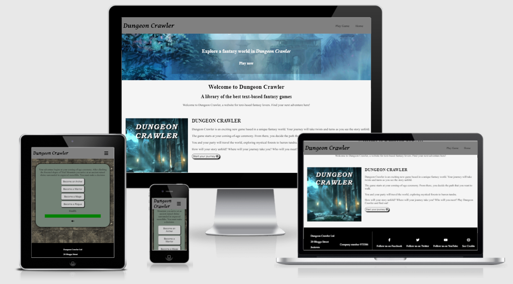

# Table of contents

- [Project Summary](#project-summary)
- [Project Design](#project-design)
  * [Project Goals](#project-goals)
  * [UX Design](#ux-design)
    + [Strategy](#strategy)
    + [Scope](#scope)
    + [Structure](#structure)
    + [Skeleton](#skeleton)
    + [Surface](#surface)
  * [Wire Frame Designs](#wire-frame-designs)
- [Development](#development)
  * [README Purpose](#readme-purpose)
  * [Site Structure](#site-structure)
  * [Naming Conventions](#naming-conventions)
  * [Languages Used](#languages-used)
  * [Tools Used](#tools-used)
- [Features](#features)
  * [Initial Features Desired](#initial-features-desired)
  * [Implemented Features](#implemented-features)
  * [Future/Desired Features](#future-desired-features)
- [Testing](#testing)
  * [Validation Testing](#validation-testing)
  * [Cross Browser and Cross Device Testing](#cross-browser-and-cross-device-testing)
  * [Manual Testing](#manual-testing)
  * [Known Fixed Bugs](#known-fixed-bugs)
    + [Aesthetic Bugs](#aesthetic-bugs)
    + [Functional Bugs](#functional-bugs)
  * [Known Unfixed Bugs](#known-unfixed-bugs)
    + [Aesthetic Bugs](#aesthetic-bugs-1)
    + [Functional Bugs](#functional-bugs-1)
- [Accessibility](#accessibility)
  * [Features](#features-1)
  * [Issues](#issues)
  * [Testing](#testing-1)
- [Deployment](#deployment)
- [Credits and Acknowledgements](#credits-and-acknowledgements)
  * [Content](#content)
  * [Media](#media)
  * [Acknowledgements](#acknowledgements)

# Project Summary
<strong>Dungeon Crawler</strong> is a website for hosting a collection of text-based adventure games using HTML, CSS and JavaScript. Each individual game may have different styles, mechanics, stories and genres. The idea of this project is to test the efficacy of creating a text-based game library with the goal of generating revenue. 
The long-term plan for Dungeon Crawler is to have recurring subscriptions to access the full library of games. Users can signup to play the free games, but must have a premium account to play the full library. 

# Project Design
The design of the website should be quite simplistic, to reflect the games hosted. That being said, it should be styled so that it fits in with the theme of 'Dungeon Crawler' and adventure games in general. That being said, below are the design consideration took into account when making this website.

## Project Goals
The project goals are as follows:
- Create a website structure that allows for adding multiple different JavaScript text-based games
- Add an adventure game to the site, that works completely and is an enjoyable experience
- Consider in business-terms the efficacy of increasing the scale of this concept website.

## UX Design
User experience design is of utmost importance in this project. Ensuring that the user can easily navigate the site, interact with the different games and has a positive experience makes it far more likely that the user will sign up for premium services. Below are UX Design considerations that have been taken into account.

### Strategy
#### Audience
The audience is old-school gamers and current adventure enthusiasts. Games such as Dungeons and Dragons are still vastly popular, so tapping into this market would be ideal. Enthusiasts and casual gamers are still interested in text-based games, as games such as AI Dungeon have massively swept social media and YouTube.

### Scope
The project deadline is 12/08/2021. In order to keep the scope down, the user system will not be implemented. Only one game will be developed for the library. The website will be a basic demonstration of what it will become. 
The story line should have plenty of options, with many different routes the player could take. The 'epilogue' of the game should be playable. This will lead the player to their first quest. Eventually I would like to add more story and have each branch of the story filled out.

### Structure
The website will be structured to display a selection of the games available in the library. It will also link to the library in a call-to-action. The library will be in a tile format, with a thumbnail for each game, a short description underneath and a link to play the game. Each game can have different structures, but the game that will be made for demonstration purposes will be inside of a bordered div, with the text at the top, buttons underneath the text and different icons underneath representing different attributes to be linked to the player (for example, armour, weapons etc) and a health bar. Each game will have it's own directory, in order to keep them separated in a logical and tidy manner.

The game logic is quite vast, and due to time constraints many of the story lines end at either a premature demise or a demo mode message. The original idea was to have the ability to have multiple games within the site, hence the somewhat modular file structure. The site has a common set of assets and assets unique to the game. This would continue to work if other games were added.

### Skeleton
#### Wire Frame Designs

The above is the wireframe for the game's interface. Buttons will be used to interact with the game's story, each one having different paths it can lead you down. Four icons will be present for the user's weapons, armor, party and stats. A health bar will be present to keep track of the damage that the user is taking. A map will also be included that track's the player's movements throughout the world.

The index page will have a call to action at the very top leading to a featured game. Below will be thumbnails and descriptions for different games.

The settings modal will be used to allow the player to change settings such as audio and accessibility options. Each one will have an icon making it more visually accessible to a user.

The library wireframe above is an idea for how multiple games could be stored and shown to a user. Adding filters and sorts would be nice to have, but the library page may not be implemented at this stage.

### Surface

Above is the overall style of the website.

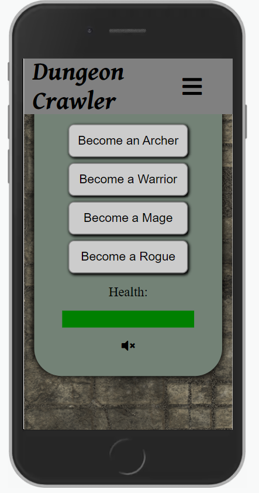

Above is how the game's inputs and information ended up. The speaker button is used to mute and unmute the game's background music. This music changes depending on the context in the game at the time. For example, battle music will play during a fight scene.

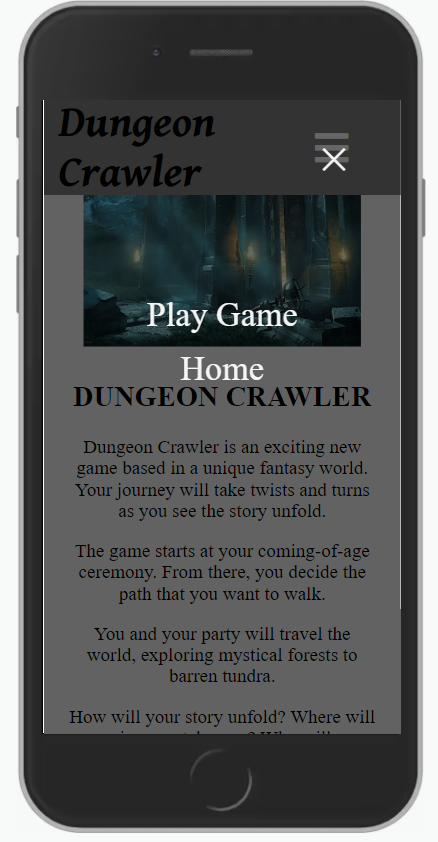

The responsive menu uses RGBA to give it's background transparency and includes a fall-back background color incase the browser does not support rgba. It takes up the full height and width of the screen.

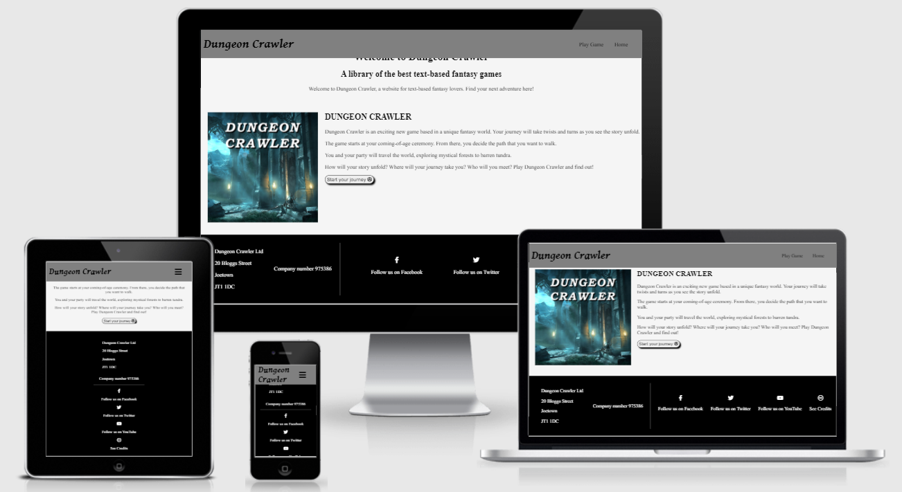

The footer is a black and white combination using sleek icons from FontAwesome. Each icon grows slightly on hover, indicating it can be clicked.

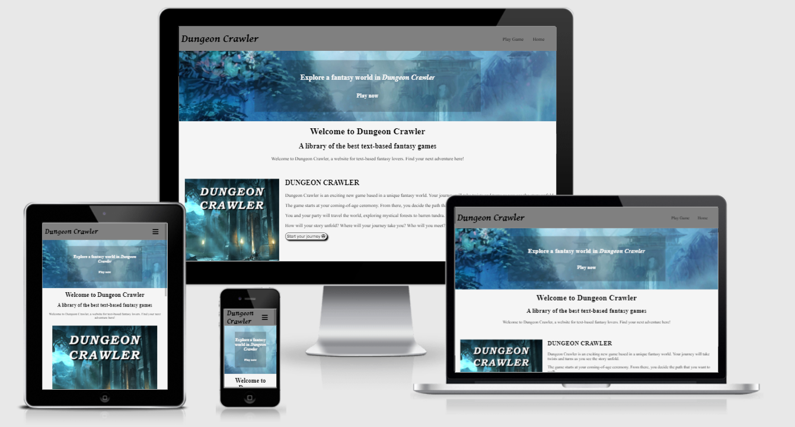

The home page features a call to action image using a mysterious fantasy background. The page also features thumbnail images for the game, descriptions of the game and a button linking the user to the game.

## Site Structure

There are two main pages present in the website, index.html (the home page) and dungeon-crawler-game.html (the text-based adventure game's page). Due to this limited number of pages, both pages just link directly to one another.

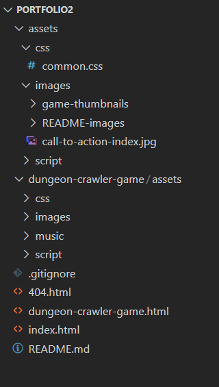

The site's file structure is more complicated, however. As the project initially was going to hold multiple games, each game's assets will have it's own folder. In the case of dungeon crawler, it has the folder dungeon-crawler-game. In the main assets folder, we have a CSS, images and script folder. The images folder breaks down further into game-thumbnails and README-images. This is to keep it organised and easy to search through. The dungeon-crawler-game assets folder has an extra folder - music. This is because each game can have it's own sound effects, background music etc. The index page doesn't need any of these, so no music will be common.

## Naming Conventions
The naming conventions for each file within the repository is using lower-case characters and hyphens to separate the words. Classes and IDs in HTML will use this same format. Variables and other names in JavaScript will use camel case (Capitalizing the first letter of each word bar the first word. For example, camelCaseHere.) 

## Languages Used
The languages used for this website are as follows:
- HTML for the structure of the pages
- CSS for styling the pages
- JavaScript for interactivity and functionality (As well as the games on the site)

## Tools Used
For the development of this site, the following tools have been used:
- GitHub for version control and storing the in-development site
- GitPod for writing the code on the website
- Balsamiq Wireframes used to draw the wireframes that the website has been based on.
- GIMP for editing pictures and images
- GitHub Pages is used for the deployment of the site
- Twine for planning the story

# Features

## Initial Features Desired

### Website
- Showcase of the different games available
- Footer including business address and social links
- Summary pages for each game

### Dungeon Crawler Game
- Party system (Who the player is with)
- Inventory system (What the player has in their possession)
- Attribute system (Shows players skills, stats)
- Map system (Shows the player a map of the world and where they are currently)
- Class system that determines what options the player has based on their character

## Implemented Features

### Navigation

Above is the responsive menu implemented into the website. On smaller screens such as tablets, this will be the primary method of navigation. Using RGBA the background has a slight transparency to it and very smoothly transitions in and out, swiping from left to right.

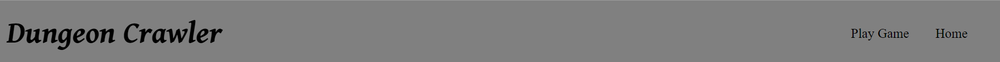

This is the navigation header, featuring the site's title and two links - Play Game and Home.

### Footer

The footer has a few useful features implemented into it. To start, the CC icon on the right/bottom of the footer is used to bring up an acknowledgements modal. Next, the user has access to all of the company's social links. Finally, to comply with UK law, the address needs to be easily accessible on the website. Of course, the address is fake.

### Acknowledgements Modal

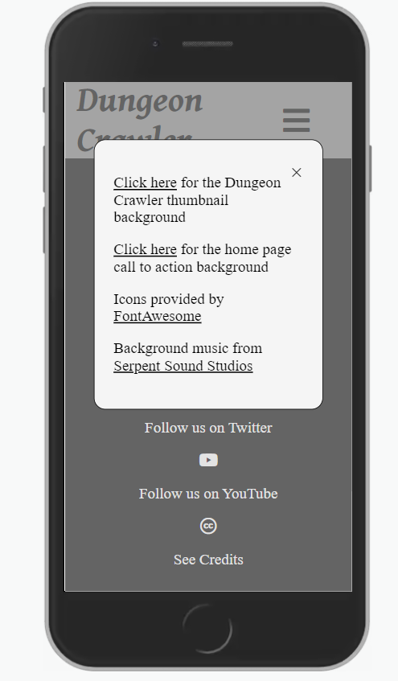

This modal is accessed using the footer's 'See Credits' link. The modal is an overlay on top of the screen, with links to various websites that helped to create this one. The icon is the logo for Creative Commons.

### Home Page

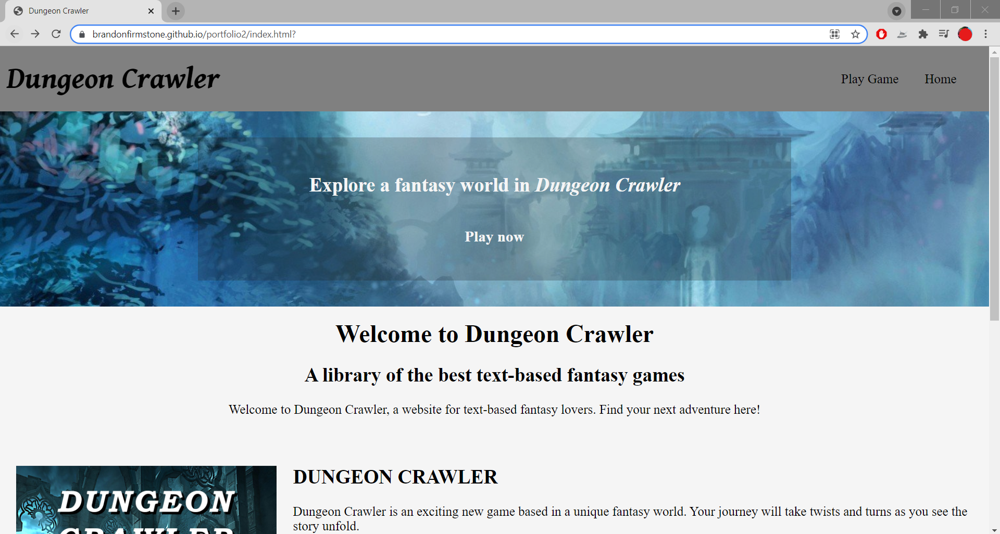

The home page has a sleek looking design and introduces the user to the namesake game. It's animated call to action should help to bring users in.

### Game Page

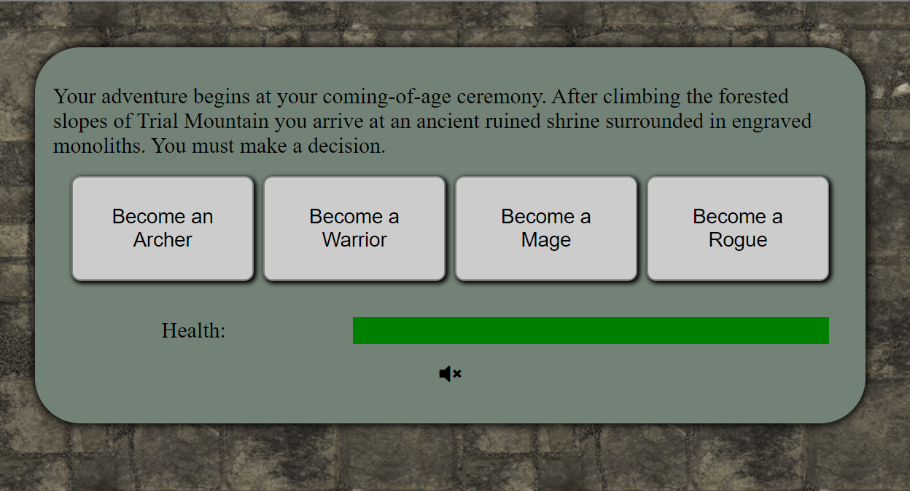

The game page holds the game board for a text based choose your own adventure. Content is dynamically built up by user's interaction based on situational options and based upon the user's initial chosen class. Each class has slightly different personalities, so each play through can be different. The health bar keeps a track of the user's damage. Once it reaches zero, that's game over. This page also includes an audio control - the speaker button at the bottom of the board. The user can use this to pause/unpause the game music. 

### Game Music

The music in the game can change depending upon the situation the player is in. For example, in a fight scene battle music would be playing. The game music is all stored in the dungeon-crawler-game/assets/music folder. The music plays with half volume and has looping enabled due to the limited choice of music.

### 404.html

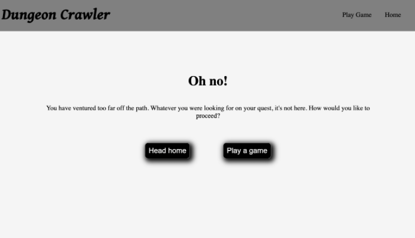

The 404 page is in the style of a text adventure game. The user is presented with two options, go to the home page or play a game. The buttons take you to index.html and dungeon-crawler-game.html respectively. The navigation and footer is also fully functional. 

### JavaScript Error

I have added a noscript error to appear on the game page if the user does not have JavaScript enabled. It also includes a handy link to help the user to sort the problem. This is only featured on the game page as other pages do not heavily rely on Javascript for functionality.

## Unimplemented Features

- The party, inventory and attribute systems have not been implemented due to time constraints. They are features that I would like to add to the game in the future.
- The map system has not been implemented due to time constraints. Producing the map of the world including the local areas that the player is can't fit into the time constraints
- Initially each game was going to have a summary page about itself, the author and any purchasing/unlocking options. I have left this out because of time constraints. It's unnecessary to have with just a single game at the moment.

## Future/Desired Features

- User Logins
- Ecommerce, user subscriptions to unlock 'Premium' games

# Testing

## Validation Testing

### Javascript Validator

#### common.js

- Missing a semi-colon on line 62, fixed
- Missing /*jshint esversion: 6 */ at the top, fixed

#### dungeon-crawler-script.js

- Missing a semi-colon on line 73, fixed

#### dungeon-crawler-story.js

- Missing semi-colon on line 591, fixed
#### 

### HTML Validator

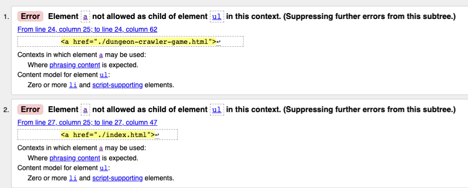

This error occurs for every HTML page. I accidentally had the a tags wrapping around the li tags. I swapped these around, fixing the issue.

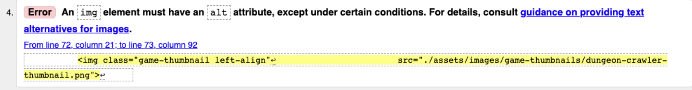

The error above occured because the thumbnail image on the index.html page was missing alt text. To correct this, I have added the description 'Fantasy Text-based Adventure Game thumbnail' to the image.

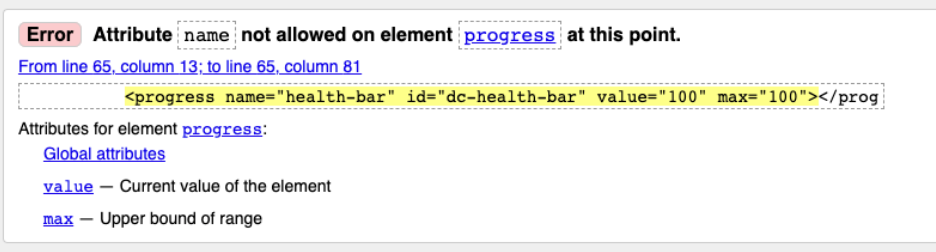

The error above explains that the progress bar used for the health system cannot have an attribute of name. To fix this, I removed the attribute and it's value.

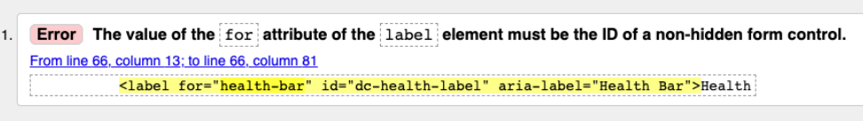

The error above occurs because I tried to link the label to the health bar through the name attribute. To fix this, I simply put the health bar's ID in it's place.

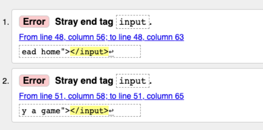

The above errors are caused in the 404.html file because I added closing tags to the button inputs rather than having them close themselves. To fix this, I changed them to end like ``<input />``

### CSS Validator

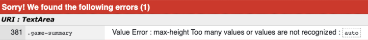

The above error is caused by the max-height and height value of auto in common.css. To fix this, I simply removed the height and max-height values.

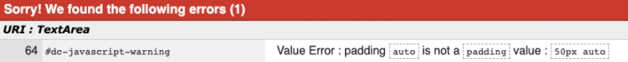

The above error is shown because I used a value of auto in padding. To fix this, I removed the auto value.

### Validator summary

| Validation Failures                           | Errors                                                                                                                                                                                                 |
|-----------------------------------------------|--------------------------------------------------------------------------------------------------------------------------------------------------------------------------------------------------------|
| **JSHINT** dungeon-crawler-script.js          | missing semi colon on line 73                                                                                                                                                                          |
| **JSHINT** dungeon-crawler-story.js           | Missing a semi colon on Line 665                                                                                                                                                                       |
| **JSHINT** common.js                          | Need to add  /*jshint esversion: 6 */  to the top to suppress let messaging Missing a semi colon on Line 61                                                                                   |
| **Nu HTML Checker** index.html                | Element a not allowed as a child of element u An img element must have an alt attribute                                                                                                             |
| **Nu HTML Checker** dungeon-crawler-game.html | Element a not allowed as a child of element u Attribute name not allowed on element progress bar The value of the for attribute of the label element must be the ID of a non-hidden form control |
| **Nu HTML Checker** 404.html                  | Element a not allowed as a child of element u Stray end tag input                                                                                                                                   |
| **JIGSAW** common.css                         | 381 	 .game-summary 	 Value Error : max-height Too many values or values are not recognized : auto                                                                                           |
| **JIGSAW** dc-style.css                       | 64 	 #dc-javascript-warning 	 Value Error : padding auto is not a padding value : 50px auto                                                                                                  |

## Cross Browser and Cross Device Testing

| Device            | Screen Size | Operating System | Browser | Browser Version | Page Tested               | Results | Comments                                                           |
|-------------------|-------------|------------------|---------|-----------------|---------------------------|---------|--------------------------------------------------------------------|
| Oppo Find X2 Lite | 1080x2400   | Android 11       | Chrome  | 92.0.4515.131   | Index.html                | Fail    | Footer address text-aligned to the left, looks unusual             |
| Oppo Find X2 Lite | 1080x2400   | Android 11       | Chrome  | 92.0.4515.131   | Index.html                | Pass    | Footer address looks better with changes                           |
| Oppo Find X2 Lite | 1080x2400   | Android 11       | Opera   | 64.2.3282.60128 | dungeon-crawler-game.html | Pass    |                                                                    |
| HP Omen Laptop    | 1920x1080   | Windows 10       | Chrome  | 92.0.4515.131   | Index.html                | Pass    | Can be quite slow to load - could be my internet connection though |
| HP Omen Laptop    | 1920x1080   | Windows 10       | Edge    | 92.0.902.67     | Index.html                | Pass    |                                                                    |
| HP Omen Laptop    | 1920x1080   | Windows 10       | Edge    | 92.0.902.67     | dungeon-crawler-game.html | Pass    |                                                                    |
| HP Omen Laptop    | 1920x1080   | Windows 10       | Edge    | 92.0.902.67     | 404.html                  | Pass    |                                                                    |
| HP Omen Laptop    | 1920x1080   | Windows 10       | IE      | 21H1            | dungeon-crawler-game.html | Pass    |                                                                    |

## Manual Testing

| Task/Function                          | Result | Comments                                                                                                                                                       |
|----------------------------------------|--------|----------------------------------------------------------------------------------------------------------------------------------------------------------------|
| Can you play through the current game? | Pass   | The game does run as intended, meaning the user can get the full experience                                                                                    |
| Does every animation work?             | Pass   | Animations work successfully on desktop and larger devices on hover, but on touchscreen devices the animation only plays when they are selected.               |
| Does every navigation link work?       | Pass   | Every navigation link works, but I have noticed that on the 404.html and dungeon-crawler-game.html pages the site title doesn't navigate you to the home page. |
| Does the music play correctly?         | Pass   | The music does play correctly throughout the game.                                                                                                             |

## Known Fixed Bugs

### Aesthetic Bugs

- 12/08/2021 - There's a slight wobble left to right on mobile view. Nothing seems to exceed the width of the screen, but even adding `overflow-x: hidden !important` hasn't fixed the issue. UPDATE: After restarting my browser it now works as expected.

### Functional Bugs

- 12/08/2021 - Audio played overlapped every time you click an option. Somewhat fixed, now the audio does not overlap but the audio does stop and start again on every option click. FIXED - Fixed this through adding typeof to if statement
- 12/08/2021 - 'Play a game' button in 404.html took you to an unusual place in the repository, meaning the CSS and page did not load properly. To fix this, I changed the link that the button took you to.

## Known Unfixed Bugs

### Aesthetic Bugs

### Functional Bugs

# Accessibility

## Features

## Issues

## Testing

# Deployment
The deployment process is the process of allowing end users to access the software application. In this case, I am deploying the Dungeon Crawler website to Github Pages as a live website publicly accessible. 

## Step One

The first step is to navigate to the site's repository on GitHub. This is where all of the files are stored during the development process. Here you can see every file in the repository, about the project on the right side and can view changes (known as commits). From here, we need to navigate to the settings page (highlighted in red)

## Step Two

The settings page is where you can manage the different aspects of the repository, including who has access to it and the repository name. From this page, we need to navigate to near the bottom of this page to 'Pages' (highlighted in red)

## Step Three

From GitHub Pages, you will want to click the dropdown box under Source and select the branch of your repository that you want to host. In this case, my only branch is the main one highlighted in red.

The next step is to simply click the save button highlighted in red.

## Completion

After clicking save, the below message appears confirming that the site has been published to GitHub Pages. Upon clicking this link it will take you to the live site as shown below.

# Credits and Acknowledgements

## Content
- All text content was written by myself.

## Media
- https://www.teahub.io/viewwp/ioxwobJ_copyright-free-images-fantasy/ - Dungeon Crawler Thumbnail background
- https://wallpapercave.com/fantasy-full-hd-desktop-wallpapers - Index call to action background
- Icons provided by FontAwesome

## Acknowledgements
- https://www.w3schools.com/howto/tryit.asp?filename=tryhow_js_sidenav helped with the navigation menu for mobile devices
- https://www.w3schools.com/js/js_let.asp for adding {} around code to prevent producing global variables
- https://www.youtube.com/watch?time_continue=119&v=R1S_NhKkvGA&feature=emb_title&ab_channel=WebDevSimplified helped design game
- https://www.deviantart.com/sharandra/art/Dungeon-Floor-419227141 dungeon texture
- https://www.serpentsoundstudios.com/royalty-free-music/celtic-fantasy background music
- onlineconverter.com for compressing mp3 files
